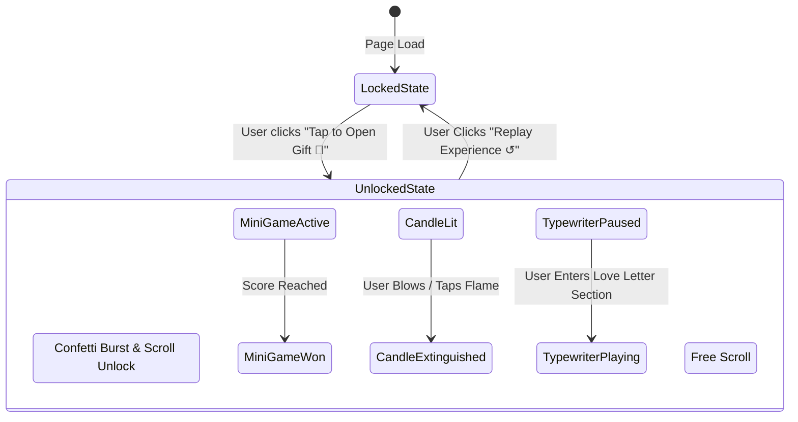

# 🏗️ Birthday Website — System Architecture & Technical Design

Comprehensive technical architecture and component design for the single-page, mobile-first interactive birthday website based on [context.md](file:///c:/Users/mbbha/OneDrive/Desktop/Case%20Study/Bday/context.md).

---

## 1. High-Level System Architecture

The application is built as a pure client-side **React Single Page Application (SPA)** using **Vite**, **Tailwind CSS**, and **Framer Motion**. It requires zero backend infrastructure and compiles into optimized static assets ready for deployment on Vercel, Netlify, or GitHub Pages.

```mermaid
graph TD
    subgraph Client Application [React SPA (Vite)]
        Root[App.tsx Root Controller]
        
        subgraph Core Systems
            AudioSystem[Audio & Sound FX Engine<br/>useAudioPlayer / Web Audio API]
            FXSystem[Visual FX & Particle Engine<br/>canvas-confetti / Cursor Trails]
            StateStore[Global State Context<br/>AppProvider: Unlocked, Audio, Progress]
            ConfigStore[Configuration & Content Layer<br/>src/data/config.ts]
        end

        subgraph Mascot Engine
            DinoEngine[Cute Dino Mascot System<br/>Contextual Poses, Idle Wiggle, SVG/Lottie]
        end

        subgraph Interactive Page Sections
            S1[1. Hero & Gift Unlock Gate]
            S2[2. Countdown & Moment Tracker]
            S3[3. Polaroid Memory Gallery]
            S4[4. Swipeable Reason Stack]
            S5[5. Interactive Mini-Game]
            S6[6. Candle & Wish Section]
            S7[7. Typewriter Love Letter]
            S8[8. Outro & Replay Signature]
        end
    end

    ConfigStore --> S1 & S2 & S3 & S4 & S5 & S6 & S7 & S8
    StateStore --> S1 & S2 & S3 & S4 & S5 & S6 & S7 & S8
    DinoEngine -.-> S1 & S2 & S3 & S6 & S8
    FXSystem -.-> S1 & S5 & S6 & S8
    AudioSystem -.-> Root & S7
```

---

## 2. Directory & File Structure

```text
bday-app/
├── index.html                       # Entry HTML with Google Fonts & meta tags
├── package.json
├── vite.config.ts                   # Vite build configuration & alias mappings
├── tailwind.config.js               # Theme customization: colors, keyframes, fonts
├── postcss.config.js
├── tsconfig.json
├── public/
│   ├── audio/
│   │   ├── romantic_bgm.mp3         # Background music track
│   │   ├── pop.mp3                  # Bubble/heart pop sound effect
│   │   ├── confetti.mp3             # Party blower / confetti SFX
│   │   └── blow_candle.mp3          # Candle extinguish wind SFX
│   └── photos/                      # Recipient photos for memory gallery
└── src/
    ├── main.tsx                     # React root mount
    ├── App.tsx                      # Main single-page scroll layout & gatekeeper
    ├── index.css                    # Tailwind directives, custom scrollbars, gradient blobs
    │
    ├── config/
    │   └── siteConfig.ts            # SINGLE SOURCE OF TRUTH for all personalization data
    │
    ├── context/
    │   └── AppContext.tsx           # Global state: isUnlocked, isMuted, activeSection, gameCompleted
    │
    ├── components/
    │   ├── common/
    │   │   ├── BackgroundBlobs.tsx  # Floating ambient gradient spheres with blur
    │   │   ├── AudioToggle.tsx      # Floating sound toggle with wave animation
    │   │   ├── CursorTrail.tsx      # Sparkle/heart cursor follower (desktop)
    │   │   ├── FloatingEmojis.tsx   # Background floating emoji particle field
    │   │   └── MascotDino.tsx       # Reusable SVG Dino with expression & animation props
    │   │
    │   ├── sections/
    │   │   ├── HeroSection.tsx      # Landing hero with animated headline & "Open Gift" CTA
    │   │   ├── CountdownSection.tsx # Real-time relationship/age timer with flip digit cards
    │   │   ├── GallerySection.tsx   # 3D interactive polaroids with flip captions & tilt
    │   │   ├── LoveStackSection.tsx # Tinder/sticky-notes card stack with drag & swipe
    │   │   ├── MiniGameSection.tsx  # Heart Pop / Scratch-card interactive game
    │   │   ├── WishSection.tsx      # Interactive birthday cake, flame blowout & confetti
    │   │   ├── LoveLetterSection.tsx# Typewriter-effect slow-reveal letter with music hook
    │   │   └── OutroSection.tsx     # Floating hearts, sign-off, and replay button
    │   │
    │   └── ui/
    │       ├── Button.tsx           # Bouncy spring-animated button with sound trigger
    │       ├── Card.tsx             # Glassmorphism frosted card container
    │       └── SectionHeading.tsx   # Standardized bubbly gradient title component
    │
    ├── hooks/
    │   ├── useAudio.ts              # Hook for BGM and sound effect playback
    │   ├── useConfetti.ts           # Configured canvas-confetti burst helper
    │   ├── useTypewriter.ts         # Smooth text typewriter reveal hook
    │   └── useScrollSpy.ts          # Tracks active visible section on scroll
    │
    ├── types/
    │   └── index.ts                 # TypeScript interfaces for config and components
    │
    └── utils/
        ├── confettiHelpers.ts       # Specialized confetti routines (schoolPride, fireworks, hearts)
        └── dateCalculators.ts       # Days/hours/minutes countdown calculation logic
```

---

## 3. Core Modules & Component Specifications

### 3.1. Centralized Configuration Layer (`src/config/siteConfig.ts`)
Decouples all personal details, texts, photos, and secrets from code so non-technical customization is instant.

```typescript
export interface SiteConfig {
  recipient: {
    name: string;
    nickname?: string;
    birthDate: string;        // ISO format e.g. "2002-09-02T00:00:00"
    knownSinceDate: string;   // ISO format for relationship counter
  };
  sender: {
    name: string;
    signatureText: string;
  };
  music: {
    src: string;
    title: string;
    artist: string;
    autoPlayOnUnlock: boolean;
  };
  photos: Array<{
    id: string;
    src: string;
    caption: string;
    rotationDeg: number;
  }>;
  reasons: Array<{
    id: number;
    title: string;
    message: string;
    emoji: string;
    color: string;
  }>;
  loveLetter: {
    paragraphs: string[];
    speedMs: number;
  };
  miniGame: {
    targetScore: number;
    gameType: 'heart-pop' | 'quiz' | 'scratch-card';
    rewardMessage: string;
  };
}
```

---

### 3.2. State Management (`src/context/AppContext.tsx`)
A lean React Context managing application progression:



| State Property | Type | Purpose |
| :--- | :--- | :--- |
| `isUnlocked` | `boolean` | Gates the page scroll; `false` keeps recipient focused on the Hero gift box |
| `isPlayingMusic` | `boolean` | Controls background romantic ambient music |
| `isMuted` | `boolean` | Global audio mute toggle |
| `gameScore` | `number` | Score counter for the interactive mini-game |
| `isCandleBlown` | `boolean` | Tracks whether birthday candle was blown out |
| `activeSection` | `string` | ID of the current section in viewport |

---

### 3.3. Mascot Engine (`MascotDino.tsx`)
A reusable vector mascot rendered with distinct poses, animated via Framer Motion spring physics.

```typescript
export type DinoPose = 
  | 'waving'       // Hero: Holding balloon / party hat
  | 'peeking'      // Countdown / Gallery: Peeking over card border
  | 'heart-eyes'   // Reasons / Love letter: Blushing with floating mini-hearts
  | 'blowing'      // Wish section: Blowing candle with breath particles
  | 'celebrating'  // Outro / Game won: Jumping with party poppers
  | 'sleepy';      // Idle after inactivity
```

- **Implementation:** Vector SVG with modular facial features and hands driven by SVG transforms.
- **Micro-interactions:** Bounces on hover/tap, wiggles periodically on idle, reacts to scroll trigger.

---

### 3.4. Section Breakdown & Interaction Mechanics

```mermaid
classDiagram
    class HeroSection {
        +isUnlocked: boolean
        +handleUnlockGift()
        +triggerInitialConfetti()
    }
    class CountdownSection {
        +targetDate: Date
        +flipNumberAnimation()
        +dinoPeekingState()
    }
    class GallerySection {
        +photos: Photo[]
        +activeCard: string
        +handleFlip(id)
        +handleTilt3D(event)
    }
    class LoveStackSection {
        +cards: ReasonCard[]
        +currentIndex: number
        +handleSwipe(direction)
        +handleNext()
    }
    class MiniGameSection {
        +score: number
        +target: number
        +spawnTarget()
        +handlePop(id)
    }
    class WishSection {
        +isCandleBlown: boolean
        +handleBlowCandle()
        +triggerHeartShower()
    }
    class LoveLetterSection {
        +paragraphs: string[]
        +typewriterProgress: number
        +startMusicIfSilent()
    }
    class OutroSection {
        +handleReplay()
        +dinoFarewellSign()
    }
```



#### 1. Hero & Gift Gate (`HeroSection.tsx`)
- **Visuals:** Full-screen gradient backdrop, ambient blurred blobs, floating particle emojis (`🎈🎂💖✨`).
- **Interaction:** A pulsing 3D gift box with ribbon.
- **Action:** Clicking triggers a massive confetti explosion + sound effect, flips `isUnlocked` to `true`, and smoothly scrolls into the next section.

#### 2. Countdown & Relationship Tracker (`CountdownSection.tsx`)
- **Calculation:** Computes elapsed time since `knownSinceDate` and countdown to `birthDate`.
- **Display:** Retro flip-clock numerical cards with smooth Framer Motion height transitions.
- **Mascot:** Dino peeking out from the top corner of the flip-cards.

#### 3. Polaroid Memory Gallery (`GallerySection.tsx`)
- **Layout:** Masonry/Flex grid of vintage polaroid frames with handwriting captions.
- **Interaction:**
  - **Desktop:** CSS 3D perspective tilt following cursor movement.
  - **Mobile:** Tap to flip card 180° revealing secret inside jokes on back.

#### 4. "Reasons I Love You" Card Stack (`LoveStackSection.tsx`)
- **Mechanism:** Interactive card stack (reminiscent of sticky notes or Tinder swipe).
- **Physics:** Drag with Framer Motion `drag="x"`, auto-dismiss threshold with spring release.
- **Feature:** Shuffle button to cycle randomly with sound feedback.

#### 5. Mini-Game: Heart Pop / Scratch Reveal (`MiniGameSection.tsx`)
- **Objective:** Pop 10 floating neon heart bubbles within 15 seconds or scratch a digital foil to reveal a hidden greeting.
- **Audio Feedback:** Synthesized bubble pop sound via Web Audio API.
- **Reward:** Unlocks a celebration badge + mascot cheer.

#### 6. Candle & Wish Section (`WishSection.tsx`)
- **Visuals:** Multi-tier illustrated birthday cake with glowing animated SVG flame.
- **Interaction:**
  - Click/Tap on the flame or microphone blow detection (optional HTML5 audio stream analyzer).
  - Flame turns into smoke particle animation, background dims into cozy mode, and confetti shoots upwards.

#### 7. Typewriter Love Letter (`LoveLetterSection.tsx`)
- **Mechanism:** Intersection observer activates smooth typewriter text animation line-by-line.
- **Music Sync:** If BGM is paused, prompts user with a gentle pulse to enable audio for the letter.

#### 8. Outro & Signature (`OutroSection.tsx`)
- **Visuals:** Sender signature with handwritten cursive font, endless floating heart stream.
- **Actions:** "Replay from Start ↺" button (smooth scrolls to top and resets states).

---

## 4. Visual Design & Style Tokens

### 4.1. Tailwind Theme Configuration (`tailwind.config.js`)

```javascript
module.exports = {
  content: ["./index.html", "./src/**/*.{js,ts,jsx,tsx}"],
  theme: {
    extend: {
      colors: {
        bday: {
          pink: '#FF3EA5',
          violet: '#8B5CF6',
          sky: '#38BDF8',
          yellow: '#FFE066',
          mint: '#5EEAD4',
          cream: '#FFF9F0',
          night: '#1A1025',
          card: 'rgba(255, 255, 255, 0.75)',
        }
      },
      fontFamily: {
        bubbly: ['"Baloo 2"', '"Fredoka"', 'cursive'],
        body: ['"Nunito"', '"Inter"', 'sans-serif'],
        handwriting: ['"Caveat"', 'cursive'],
      },
      animation: {
        'blob-float': 'blobFloat 8s ease-in-out infinite alternate',
        'wiggle': 'wiggle 1s ease-in-out infinite',
        'candle-flicker': 'flicker 1.5s ease-in-out infinite alternate',
      },
      keyframes: {
        blobFloat: {
          '0%': { transform: 'translate(0px, 0px) scale(1)' },
          '100%': { transform: 'translate(30px, -40px) scale(1.15)' },
        },
        wiggle: {
          '0%, 100%': { transform: 'rotate(-3deg)' },
          '50%': { transform: 'rotate(3deg)' },
        },
        flicker: {
          '0%': { transform: 'scale(1) skewX(-1deg)', opacity: '0.9' },
          '100%': { transform: 'scale(1.08) skewX(2deg)', opacity: '1' },
        }
      },
      boxShadow: {
        'glow-pink': '0 0 25px rgba(255, 62, 165, 0.45)',
        'glow-violet': '0 0 25px rgba(139, 92, 246, 0.45)',
        'polaroid': '0 10px 30px -5px rgba(0, 0, 0, 0.15)',
      }
    },
  },
  plugins: [],
}
```

---

## 5. Performance & Mobile Optimization Strategy

1. **Mobile-First Touch Handling:**
   - Active tap states (`active:scale-95`) with 0ms touch delay.
   - Fallbacks from cursor hover effects to tap-to-toggle cards on touch devices.

2. **Asset Optimization:**
   - Mascots and stickers rendered as optimized inline SVGs (zero network payload).
   - Gallery images wrapped in `loading="lazy"` with low-res blur placeholders.
   - Audio tracks compressed to lightweight MP3/AAC files (~500KB total).

3. **Rendering Performance:**
   - Framer Motion animations hardware-accelerated using `transform` and `opacity` only.
   - `will-change: transform` on floating background blobs.
   - Particle counts on mobile throttled to maintain steady 60 FPS.

---

## 6. Development & Build Roadmap

| Step | Milestone | Key Deliverables |
| :---: | :--- | :--- |
| **Phase 1** | Project Initialization | Vite + React + TypeScript + Tailwind + Framer Motion setup |
| **Phase 2** | Design Tokens & Global Context | Theme colors, Google Fonts, `AppContext`, and `siteConfig.ts` |
| **Phase 3** | Mascot & Effects Engine | `MascotDino.tsx`, `useConfetti.ts`, `BackgroundBlobs.tsx` |
| **Phase 4** | Hero & Gatekeeper | Gift unlock animation, hero confetti burst, scroll unlock |
| **Phase 5** | Core Interactive Sections | Countdown, 3D Polaroid Gallery, Reason Swipe Stack |
| **Phase 6** | Gamification & Wish Experience | Heart Pop Mini-Game, Birthday Cake Flame Blowout |
| **Phase 7** | Letter, Audio & Outro | Typewriter text reveal, BGM player, Floating Heart Outro |
| **Phase 8** | Polish & Mobile QA | Cross-device testing, spring physics tuning, static build test |
